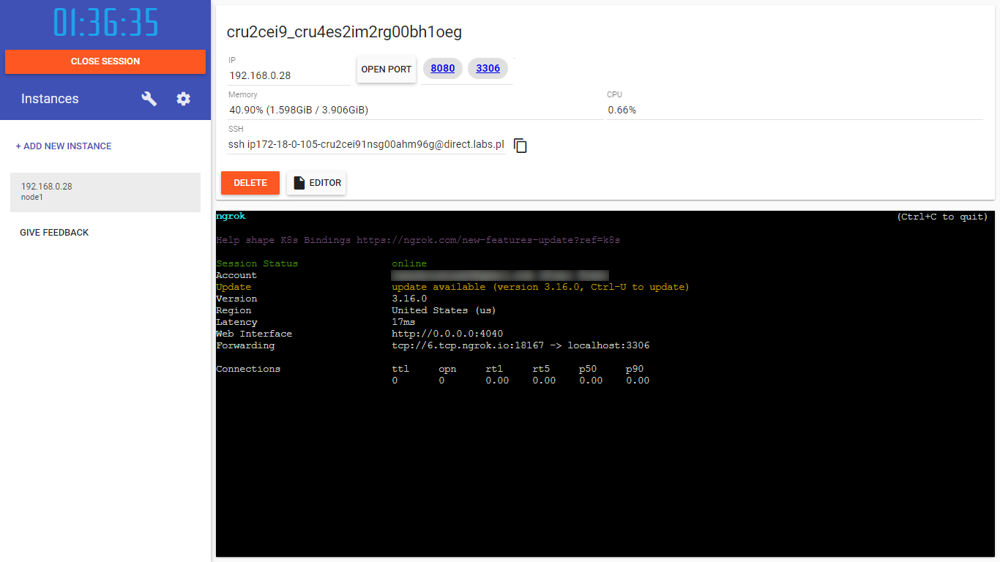

<h1 align="center"> 
    public_mysql_server
</h1>

# Índice

- [Sobre](#sobre)
- [Requisitos](#requisitos)
- [Como usar](#como-usar)

<a id="sobre"></a>
## 🔖 Sobre 

- Este repostório serve para mostrar como criar um servidor MySQL público no Play with Docker utilizado o Ngrok, por conta da limitação por design do website em relação a Port Forwarding

- O Play with Docker só surporta o Port Forwarding de serviços [HTTP, HTTPS e Websockets](https://github.com/play-with-docker/play-with-docker/issues/373), mas não de serviços [TCP](https://github.com/play-with-docker/play-with-docker/issues/277)

<a id="Requisitos"></a>
## 📄 Requisitos

- Conta no [Docker Hub](https://hub.docker.com/) (por conta do `rate limit` que o Docker impõe caso tenha muito pulls com o uso anônimo, e para usar o Play with Docker)

- Conta no [Ngrok](https://ngrok.com/) (para usar o seu `authtoken` para conseguir utilizar o serviço do Ngrok com TCP)

<a id="como-usar"></a>
## ⚡ Como usar no [Play with Docker](https://labs.play-with-docker.com/)

Copie os comando abaixo no Terminal do `Play with Docker`

```bash
git clone https://github.com/marshfellow42/public_mysql_server

cd public_mysql_server

chmod +x rode_isso_no_shell

./rode_isso_no_shell
```

Para checar se realmente funcionou, rode o [script](https://github.com/marshfellow42/public_my_sql_server/blob/main/script.py) Python na sua máquina

Mas antes de rodar o script, você precisa baixar um "driver" para conseguir se comunicar com o MySQL

```bash
pip install mysql-connector-python
```

Depois você checa o Terminal do Play with Docker para saber o link que eles te dão

Ex: `tcp://6.tcp.ngrok.io:18167`



Daí, você modifica o código Python com partes desse link

```python
host="6.tcp.ngrok.io", # Insira seu host do ngrok aqui
port=18167 # Insira seu post do ngrok aqui
```

E pronto, você têm um servidor MySQL público na qual você pode acessar em qualquer canto do mundo sem nenhum gasto extra